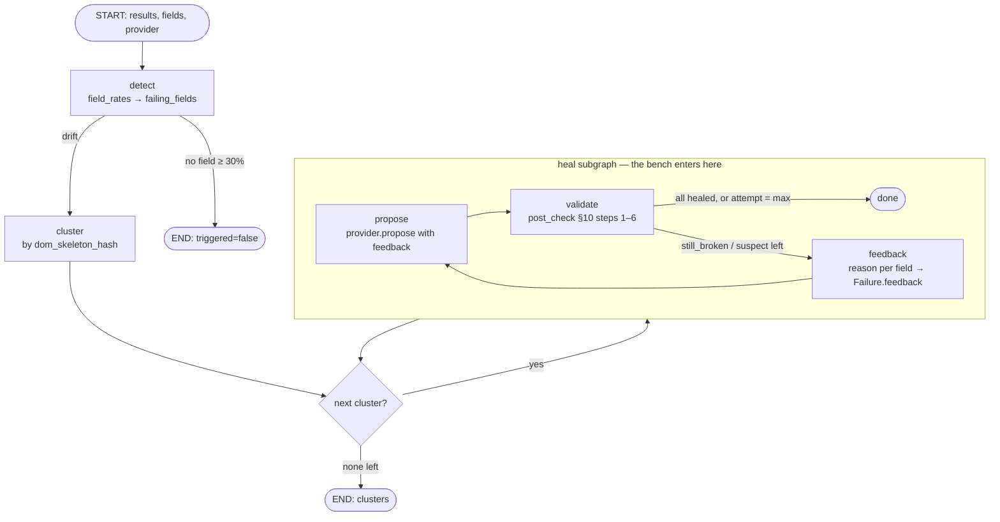

# Section D — Heal loop as a LangGraph state graph + MCP server

Requirement: orchestrate the self-healing loop (drift detection, selector regeneration, validation,
retry) as a LangGraph state graph, and expose extraction jobs through an MCP server so Claude Code
and other agents can trigger runs and inspect results.

## Decisions (locked 2026-10-07)

| # | Fork | Choice |
|---|---|---|
| 1 | What a retry sends back | **A — rejection reason only.** The prompt gets the previous selector and why it was rejected. It never gets the anchor value, so the anchor check stays independent of the prompt. It may echo the model's *own* extracted value. Retries cover `still_broken` and `suspect`; at most 3 attempts per cluster. |
| 2 | MCP transport | **A — standalone stdio FastMCP process** calling the HTTP API via httpx. No DB access. |
| 3 | Agent may apply heals | **B — `healed` only.** `accept_heal` takes field *names*, not selectors. The selector comes from this process's last `propose_heal` result for the batch, and it refuses anything that wasn't `healed`. |
| 4 | Batch discovery | **A + B** — `GET /batches` + `list_batches`, and `upload_html(path)` (file or directory). |

Routine calls (not user forks): one graph shared by the API and the bench; clusters run
sequentially; the graph stops at proposals; `--max-attempts 1` is today's code path.

## Graph

- **Outer graph** (`detect → cluster → heal each cluster`) is what `/heal/propose` invokes. DB reads
  stay in the route; the graph gets `results` as input.
- **Heal subgraph** (`propose → validate → retry?`) is a compiled graph of its own. The bench
  invokes it directly with a one-page "cluster", so the bench measures the shipped loop.
- No provider configured → the subgraph is skipped and the cluster reports `model: "unavailable"`,
  the same as today.

## Changes

- `spike/heal/provider.py` — `Failure.feedback: tuple[str, ...] = ()`. Holds previous attempts as
  `"<selector> — <reason>"` lines. No ABC change, so providers need no edits.
- `spike/heal/prompt.py` — renders feedback under its field only when non-empty, so the
  attempt-1 prompt stays byte-identical (golden test).
- `app/heal.py::post_check` — every verdict gets a `reason` string (additive key).
- `app/heal_graph.py` — new. Outer graph + heal subgraph. Keeps the best verdict per field across
  attempts (healed > suspect > still_broken; ties keep the earlier one). Records `attempts`.
- `app/routes/heal.py` — `/heal/propose` invokes the graph; response shape unchanged, plus
  `attempts` per cluster and `reason` per proposal. `max_attempts` request field, default 3, range 1–5.
- `app/routes/batch.py` — `GET /batches?limit=` (newest first, with host/page_type/file_count).
- `app/mcp_server.py` — new. Tools: `list_batches`, `upload_html`, `start_parse`, `get_job`,
  `get_results` (rows capped), `propose_heal`, `accept_heal`. `SCRAPESMITH_API_URL`, default
  `http://localhost:8000`.
- `spike/bench.py` + CLI — `run_bench(..., max_attempts=1)`; `--max-attempts`. Per-result
  `attempts`. Latency stays propose-only (accumulated across attempts).
- Deps: `langgraph`, `mcp`.

## Eval

Baseline `artifacts/phase0_report.json`: healed 95.83%, resolve_but_wrong 2.08% (n=48, ollama
qwen2.5-coder:7b, greedy). Re-measure the baseline at `--max-attempts 1` on the new graph path
(must reproduce 95.83% exactly — that's the "same code path" check), then `--max-attempts 3`.
**Power limit:** 46/48 already heal, so the ceiling is +2 fields (+4.2pp); one field = 2.1pp.
A null result is a valid outcome. The guard (`resolve_but_wrong` must not rise) matters more here
because a retry can turn a "no proposal" into a wrong one.

## Tests

- `test_heal_graph.py` — `post_check` monkeypatched, so no Playwright: retries until healed,
  feedback carries the reason and never the anchor, `max_attempts=1` → one propose call, healed
  fields are not re-proposed, best verdict kept, detect short-circuits with no drift, no provider →
  unavailable.
- `test_prompt.py` — feedback rendered under its field; empty feedback = golden.
- `test_heal.py` — `reason` present on each verdict (Playwright-gated).
- `test_mcp_server.py` — httpx MockTransport: accept refuses suspect / unproposed, sends only
  healed selectors; upload zips a directory's .html files; results rows capped.
- `GET /batches` — Postgres-gated route test.

## Review fixes (2026-10-07, ponytail-review + correctness pass)

Found by the stdio smoke test:
- **mcp 2.x hides non-`ToolError` messages** — a refused accept reached the agent as a bare
  "Error executing tool accept_heal". All refusals/API errors now raise `ToolError`. ✅

Found by review:
1. **HIGH — cross-cluster accept.** `accept_heal` took the first `healed` verdict from *any*
   cluster, so a field `suspect` on the largest layout could still be written to config. Fix:
   the field must be `healed` in every cluster that proposed it.
2. **MEDIUM — anchor leak via another page.** When the anchor lives on a non-rep page,
   `anchor_ok=False` quoted the *rep's* value, which can equal the anchor. Fix: quote the value
   only when the anchor was checked on the rep; otherwise a fixed sentence with no value.
   Also covers "matched nothing on the anchor's page" (was mis-described as a wrong value).
3. **MEDIUM — stale proposal.** `/heal/propose` returns `config_version`; `/heal/accept` takes an
   optional `expected_version` → 409 on mismatch; the MCP server always sends it.
4. LOW — DQ reason names the DQ status (`type_fail`, `regex_fail`…), not a guessed kind.
5. LOW — `max_rows` clamped at 0; non-object JSON error bodies handled.
6. Shrink — redundant `.get` defaults in the heal graph.

Not taken: inlining `_client()` (it is the test seam); `flagged` is one small object per file
and stays uncapped.

## Results (2026-10-07)

| arm | healed | resolve_but_wrong | no_proposal | Ollama calls | Ollama timeouts |
|---|---|---|---|---|---|
| baseline artifact (pre-graph) | 95.83% | 2.08% | 0% | 21 | — |
| `--max-attempts 1` (graph) | 95.83% | 2.08% | 0% | 21 | 0 |
| `--max-attempts 3` (graph) | 95.83% | 2.08% | 0% | 25 | 0 |

- The attempt-1 arm's 48 (selector, status) pairs are identical to the pre-graph artifact, so the
  graph path is the same experiment.
- **Null result.** Ceiling +2 fields (+4.2pp). Trace of the retries:
  - `event__tag_swap.venue`: same selector all 3 attempts despite "matched no element".
  - `product__combo.price`: attempt 2 `.c0929-price` (same decoy, `₹2,999`), attempt 3
    `.c0b74-current` (product name, fails DQ). Best verdict kept attempt 1's `suspect`. Guard held.
- A first attempts=1 run scored 87.5%. It was invalid: the MCP smoke test shared Ollama, and two
  requests hit the 60s client timeout. See lessons.
- E2E: a real stdio MCP client against the live API + arq worker + Ollama, on amazon_product
  `after.html` with the pre-redesign config: parse 100% failure on both fields → `propose_heal`
  both `healed` on attempt 1 → `accept_heal` → v2 → re-parse 0% failure. An unproposed field is
  refused, and the reason reaches the client.
