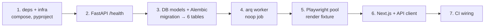

# Phase 0.5 — Repo Skeleton

> Scaffold the monorepo so every runtime piece **boots and is smoke-tested**, with zero product
> features. Grounds: design plan §7 (service architecture) + §6 (data model); scope from
> `todo.md` Phase 0.5. Phase 0 spike code (`backend/spike/`) stays untouched.

**Demo at end of phase:** `GET /health` → 200; `pnpm dev` (or `npm run dev`) renders a hello page
that fetches `/health`; arq worker processes a no-op job; Playwright renders a fixture file headless;
first Alembic migration creates all 6 tables; CI runs lint + pytest + tsc green.

---

## Requirements Restatement

1. **FastAPI (async)** app with `GET /health` → `{"status":"ok"}` 200.
2. **Postgres + first Alembic migration** creating all 6 tables from §6: `domain`, `config_version`,
   `upload_batch`, `upload_file`, `parse_result`, `job` (uuid PKs, FKs, jsonb columns, unique constraints).
3. **Redis + arq worker** smoke test: API enqueues a no-op job; worker picks it up and completes it.
4. **Playwright pool** smoke test: render `backend/fixtures/drift/amazon_product/before.html` headless
   in an isolated context; assert the DOM loaded (title/text present).
5. **Next.js** app boots; a shared **typed API client** calls `/health` and renders the result.
6. **CI**: ruff lint + pytest (backend) + `tsc --noEmit` (frontend).

**Non-goals:** upload, rendering UI, click capture, inference, parsing, healing — all later phases.
No real job logic, no auth, no request validation beyond `/health`.

---

## Current State (verified 2026-06-18)

- `backend/.venv` = **Python 3.9.6** (lessons: avoid 3.10+ syntax; use `from __future__ import annotations`).
  ⚠️ `backend/pyproject.toml` says `requires-python = ">=3.11"` — **drift**; actual runtime is 3.9. Fix to `>=3.9`.
- `backend/spike/` + `backend/tests/` = Phase 0 spike, committed, **do not touch**.
- Empty dirs already present: `backend/app/`, `frontend/`, `docs/`, `backend/artifacts/`.
- Installed: node **v25.8.1**. **No docker. No pnpm.** (both are tech-choice forks below).
- Playwright chromium already installed (global cache).

---

## Tech Choices — CONFIRM BEFORE BUILD

| # | Choice | Recommendation | Why / alternative |
|---|--------|----------------|-------------------|
| **A** | Local Postgres + Redis | **docker-compose** (needs Docker Desktop install) | Reproducible, disposable, matches prod. Alt: `brew install postgresql@16 redis` as host services — no Docker, but pollutes host + version drift. **Docker not currently installed** — pick this only if you'll install it. |
| **B** | Frontend package manager | **npm** (already have node v25) | Design doc says `pnpm dev`, but pnpm isn't installed. npm needs zero setup and works identically for a hello page. Alt: `corepack enable pnpm`. Low stakes; easy to switch later. |
| **C** | DB access layer | **SQLAlchemy 2.x async (asyncpg) + Alembic** | Design §7 says "sqlalchemy(async)". Standard, migration-friendly. |
| **D** | Migration = ORM models or raw SQL | **ORM models → Alembic autogenerate** | Models get reused Phase 4+. Slightly more scaffold now, but avoids a raw-SQL→ORM rewrite. |
| **E** | Next.js flavor | **App Router + TypeScript, no Tailwind yet** | Minimal boot. Tailwind/UI arrives when we build screens (Phase 1). |

Defaults if you just say "proceed": **A=docker-compose, B=npm, C/D/E as recommended.**

**DECIDED 2026-06-18 (autonomous run):** B=npm; C/D/E as recommended. **A = commit `docker-compose.yml`
as the canonical dev infra, but Docker Desktop is not installed locally, so pg+redis are installed via
`brew install postgresql@16 redis` for local smoke-test verification.** docker-compose stays the
documented path (used in CI as service containers + by anyone with Docker); brew is the local stand-in.

---

## Proposed Layout

```
docker-compose.yml            # postgres:16 + redis:7 (choice A)
.github/workflows/ci.yml      # lint + pytest + tsc
backend/
  app/
    __init__.py
    main.py                   # FastAPI app + /health
    config.py                 # env settings (DATABASE_URL, REDIS_URL) via pydantic-settings
    db.py                     # async engine + session factory
    models.py                 # SQLAlchemy models: 6 tables (§6)
    worker.py                 # arq WorkerSettings + noop task
    queue.py                  # arq redis pool accessor (enqueue helper)
    render.py                 # Playwright pool (minimal: 1 browser, ephemeral context) + render_file()
  alembic/
    env.py, script.py.mako, versions/0001_initial.py
  alembic.ini
  tests/
    test_health.py            # /health 200 (httpx ASGITransport)
    test_worker_smoke.py      # enqueue noop → worker runs it (gated on REDIS_URL)
    test_render_smoke.py      # render before.html headless (gated on SKIP_PLAYWRIGHT)
    test_migration_smoke.py   # alembic upgrade head on a test DB (gated on DATABASE_URL)
  pyproject.toml              # add: fastapi, uvicorn, sqlalchemy[asyncio], asyncpg, alembic,
                              #      arq, pydantic-settings, pytest-asyncio; fix requires-python
frontend/
  package.json, tsconfig.json, next.config.ts
  app/layout.tsx, app/page.tsx        # hello + /health fetch
  lib/api.ts                          # typed client: getHealth()
  .env.local.example                  # NEXT_PUBLIC_API_BASE=http://localhost:8000
```

`backend/app/` stays a **separate package** from `backend/spike/` — the skeleton imports nothing from
the spike, and vice versa. Heal provider interface gets *wired in* at Phase 6, not now.

---

## Step-by-Step (each step = one smoke test, TDD where it fits)



1. **Infra + deps.** Write `docker-compose.yml` (pg + redis); extend `backend/pyproject.toml`
   (fix `requires-python`, add runtime + dev deps); `backend/.venv/bin/pip install -e '.[dev]'`.
2. **FastAPI `/health`.** `app/main.py` + `app/config.py`. Test: `test_health.py` (RED→GREEN via
   httpx `ASGITransport`, no network).
3. **DB + migration.** `app/db.py`, `app/models.py` (6 tables per §6 incl. jsonb, uuid, uniques),
   Alembic init + `0001_initial`. Test: `test_migration_smoke.py` runs `upgrade head` against a
   throwaway DB and asserts the 6 tables exist. (Gated on `DATABASE_URL`.)
4. **arq worker.** `app/worker.py` (noop task), `app/queue.py` (enqueue). Test: `test_worker_smoke.py`
   enqueues noop and asserts the job result. (Gated on `REDIS_URL`.)
5. **Playwright pool.** `app/render.py` — minimal pool (1 headless chromium, ephemeral context per
   call), `render_file(path)->{title,text_len}`. Test: `test_render_smoke.py` on `before.html`.
   (Gated on `SKIP_PLAYWRIGHT`, mirrors spike convention.)
6. **Next.js.** Scaffold `frontend/` (App Router, TS). `lib/api.ts` typed `getHealth()`; `page.tsx`
   renders status. Manual demo: `npm run dev` → hello + health.
7. **CI.** `.github/workflows/ci.yml`: job 1 = ruff + pytest (with pg+redis service containers,
   `SKIP_PLAYWRIGHT=1` to keep CI light — Playwright smoke stays local); job 2 = `npm ci` + `tsc --noEmit`.

---

## Data model migration (§6, all 6 tables)

`0001_initial` creates: `domain` (unique host+page_type), `config_version` (unique domain_id+version,
jsonb `fields`), `upload_batch`, `upload_file`, `parse_result` (3 jsonb cols), `job` (jsonb `progress`).
UUID PKs via `server_default=gen_random_uuid()` (pgcrypto) or Python-side `uuid4`. FKs + `created_at`
timestamptz defaults. Mirrors the SQL/erDiagram in design §6 exactly — SQL there stays source of truth.

---

## Risks

| Risk | Severity | Mitigation |
|------|----------|------------|
| Docker not installed (choice A) | **MED** | Confirm A vs brew-services before build; if neither, tests needing pg/redis stay gated/skipped locally, run in CI only. |
| Python 3.9 vs async SQLAlchemy 2 / arq | LOW | Both support 3.9. Use `from __future__ import annotations`; no 3.10 syntax. |
| pyproject `requires-python>=3.11` drift | LOW | Fix to `>=3.9` in step 1. |
| CI Playwright cost/flake | LOW | `SKIP_PLAYWRIGHT=1` in CI; render smoke is local-only. |
| Scope creep into Phase 1 UI | LOW | Hard stop: hello page only, no upload/render UI. |

---

## Estimated Complexity: MEDIUM

Pure scaffold, but touches 6 runtime surfaces (API, DB, migrations, queue, browser, frontend) + CI.
No hard logic — the effort is wiring + one green smoke test each.

---

## Confirm to proceed

Reply **proceed** (accepts defaults A=docker-compose, B=npm) or adjust choices A–E. On confirm →
Step 2 TESTS (tdd skill, sonnet): write the smoke tests RED first, then Step 3 IMPLEMENT.
