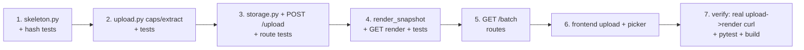

# Phase 1 — Upload + Playwright Render

> Upload HTML (single / `.gz` / `.zip`), persist + fingerprint each file, and render file N in an
> isolated headless Chromium context served read-only to the browser with a hover-outline overlay
> and Prev/Next. Grounds: design §4 flow, §5.1 upload, §5.2 picker shell, §6 `dom_skeleton_hash`
> (§411), §14 security. Builds on the Phase 0.5 skeleton.

**Demo:** upload a `.gz` (or the amazon `before.html`), pick domain/page_type/JS toggle → land on a
picker that shows file 1 rendered in a real browser DOM with a hover outline; Prev/Next navigates
"File N of M".

---

## Scope decisions (made up front — autonomous run)

1. **Render transport = serialized sanitized snapshot in a sandboxed `<iframe srcdoc>`**, NOT a live
   CDP screencast. Design allows either ("serialized snapshot or a live CDP-driven view"); the
   snapshot is far simpler and sufficient for picking. CDP live view can come later if needed.
2. **Overlay = hover outline only.** Click-to-select, selector generation, and the popover (§5.3) are
   **Phase 2** — explicitly out of scope here. Phase 1 proves render + nav, not selection.
3. **Egress blocked in the render context**: the Playwright context aborts every non-`file://`
   request (§14 SSRF/egress). `render_js` toggles whether page scripts run at all.
4. **Snapshot is sanitized + CSP-locked**: strip `<script>` from the serialized DOM, inject our
   overlay script inline, set a strict `<meta>` CSP so the iframe runs only our script (§14).
5. **Upload caps (zip-bomb guard)**: reject before extraction using zip metadata. Constants in
   `app/upload.py`: `MAX_FILES=500`, `MAX_FILE_BYTES=5MB`, `MAX_ARCHIVE_BYTES=50MB`,
   `MAX_TOTAL_UNCOMPRESSED=200MB`. `.gz`=single gzipped html, `.zip`=archive, bare=single html.
6. **Storage**: raw html on disk at `./uploads/{batch_id}/{n}_{safe_filename}`; DB `upload_file`
   holds `raw_html_path`, `sha256`, `dom_skeleton_hash`.
7. **domain** is get-or-create by `(host, page_type)`; `render_js` set from the form.

---

## Requirements Restatement

- `POST /upload` (multipart): file + `host`, `page_type`, `render_js`, `notes`. Validate caps,
  extract, persist, create `domain`(get-or-create) + `upload_batch` + one `upload_file` per html.
  Returns `{batch_id, domain_id, file_count, files:[{index, filename}]}`.
- `dom_skeleton_hash` per file (§411): tag tree only, dynamic attrs stripped (drop id/class/data-*
  tokens containing digits or generated-looking; keep tags, depth, stable alpha class roots, role,
  landmarks). Two structurally-identical pages hash identically.
- `GET /batch/{id}` → batch + file list.
- `GET /batch/{id}/file/{index}/render` → sanitized snapshot HTML (text/html) rendered in an isolated
  context, egress blocked, overlay + CSP injected. `render_js` honored from the domain.
- Frontend: upload screen (5.1) + picker shell (5.2 minimal) — iframe render, Prev/Next, "File N of M".

**Non-goals (Phase 2+):** click capture, selector ladder, list detection, `/pick/validate`, popover,
inference, DQ, config save.

---

## Files

```
backend/app/
  upload.py       # caps + extraction (.html/.gz/.zip), safe filenames, sha256
  skeleton.py     # dom_skeleton_hash(html) -> str  (§411)
  render.py       # EXTEND: render_snapshot(path, render_js) -> sanitized html + overlay + CSP
  storage.py      # get-or-create domain; create batch + files; uploads dir helpers
  routes/
    __init__.py
    upload.py     # POST /upload
    batch.py      # GET /batch/{id}, GET /batch/{id}/file/{i}/render
  main.py         # EXTEND: include routers
backend/tests/
  test_skeleton.py        # hash stability: same structure -> same hash; dynamic attrs ignored
  test_upload.py          # caps rejection, .gz/.zip/.html ingest, DB rows (pg-gated)
  test_render_snapshot.py # snapshot strips <script>, injects overlay, blocks egress (playwright-gated)
  test_batch_routes.py    # GET endpoints happy path + 404 (pg-gated)
frontend/
  app/page.tsx            # REPLACE hello with upload screen (5.1)
  app/pick/[batchId]/page.tsx  # picker shell: iframe render + Prev/Next
  lib/api.ts              # EXTEND: uploadBatch(), getBatch(), renderUrl()
  components/UploadForm.tsx, components/RenderFrame.tsx
```

---

## Step-by-step



1. **`skeleton.py`** — `dom_skeleton_hash`. TDD: identical structure w/ different dynamic ids/classes
   → same hash; different tag tree → different hash. (lxml already a dep.)
2. **`upload.py`** — cap constants + `extract_html_files(upload)` returning `[(filename, bytes)]`;
   raises on cap breach / zip-bomb. TDD the guards with crafted inputs.
3. **`storage.py` + `POST /upload`** — get-or-create domain, write files, insert rows. Route test
   (pg-gated) asserts DB rows + response shape.
4. **`render.py::render_snapshot`** — isolated context, `route("**")` abort non-file, optional JS,
   `page.content()`, strip scripts, inject overlay + CSP. `GET .../render`. Playwright-gated test
   asserts no `<script src>`, overlay marker present.
5. **`GET /batch/{id}`** + file list; 404 on missing.
6. **Frontend** — upload form (5.1) posts multipart, redirects to `/pick/{batchId}`; picker shows
   `renderUrl(batchId, i)` in a sandboxed iframe with Prev/Next. Minimal inline styles.
7. **Verify** — real `curl -F` upload of `before.html` → `/render` returns overlay'd snapshot;
   `pytest` green; frontend `build` + `tsc` green. Commit on dev.

---

## Security (must-not-skip — §14)

- Caps enforced **before** extraction (zip metadata sizes), per-file + total + count.
- Render context aborts all non-`file://` requests (no SSRF/egress from untrusted HTML).
- Snapshot: `<script>` stripped, strict CSP meta, our overlay is the only script; iframe `sandbox`
  attr on the frontend side too (defense in depth).
- Safe filenames on disk (no path traversal): sanitize + index-prefix; write under batch dir only.
- `render_js` off by default unless the form opts in.

---

## Risks

| Risk | Sev | Mitigation |
|------|-----|-----------|
| Path traversal via archive entry names | **MED** | sanitize to basename + index prefix; reject `..`/absolute |
| Zip bomb | **MED** | check `ZipInfo.file_size` sums before extract; caps |
| Snapshot XSS to user's browser | **MED** | strip scripts + CSP + iframe sandbox |
| Playwright throughput (later batches) | LOW | Phase 1 renders on demand, one file at a time; pool sizing is Phase 5 |
| `dom_skeleton_hash` over/under-collapsing | MED | test both directions; it only drives clustering, not correctness |

## Estimated complexity: HIGH (largest phase so far — real I/O, browser, security surface, 2 screens)
