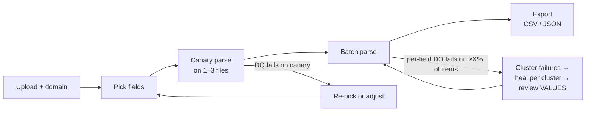
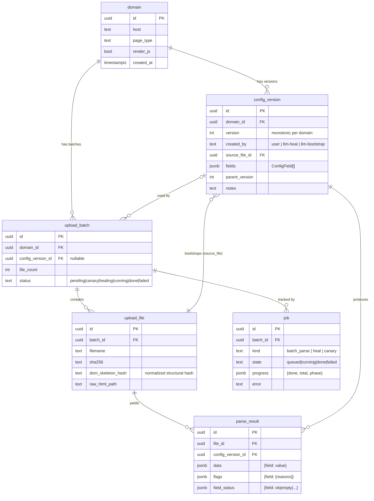
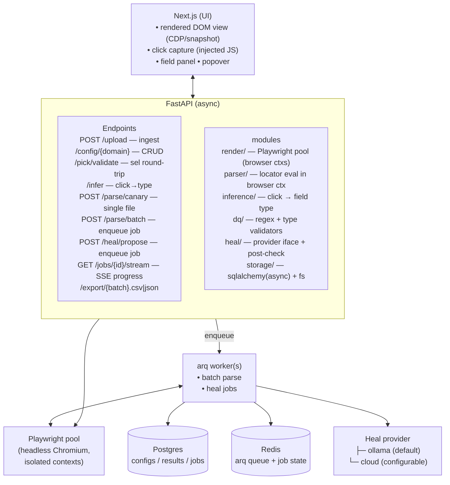

# Self-Healing Parser — Plan

**Status:** draft v2 (revised after critique)
**Owner:** Bhushan
**Last updated:** 2026-06-08

> **v2 changelog (what the critique changed):**
> - **Rendering & DOM parity:** Playwright headless Chromium is now the *single source of truth* for the DOM. Selectors are generated, highlighted, and extracted against the **same** browser DOM, so a pick that highlights always resolves. This removes the browser-DOM-vs-lxml mismatch and brings JS-rendered pages into scope (old non-goal reversed).
> - **Heal provider:** abstracted behind an interface. Local Ollama is the default; a cloud model (e.g. Claude) is a configurable escape hatch for the heal step only.
> - **Sequencing:** new **Phase 0 — Heal Spike** de-risks the headline feature with real drift pairs *before* any UI scaffolding.
> - **Heal trigger rewritten** from per-item-majority to **per-field** (the old rule provably missed single-field drift, the most common case).
> - **Semantic anchor** added: the value/position the user confirms at bootstrap is stored and becomes ground truth the heal must justify against — DQ passing is no longer sufficient.
> - **Failure clustering** before healing (drift is not homogeneous; multiple new layouts get healed and validated per cluster).
> - **`dom_skeleton_hash` redefined** to strip dynamic attributes so it actually collides on like layouts.
> - **Async job model** (arq worker + browser pool + progress stream) added for batch/heal — synchronous endpoints would have timed out.
> - **Selector stability ladder, list-detection algorithm, and output schema** promoted out of "open questions" into specified design — they were MVP-blocking.
> - **Interactive LLM inference is now opt-in** ("Ask AI?"), not an automatic per-click round-trip.
> - **Versioning concurrency lock** added.
> - **Security:** isolated ephemeral browser context, network egress blocked/proxied with an SSRF guard.
> - **Diagrams:** end-to-end flow (§4) and service architecture (§7) converted to Mermaid per the project diagram standard; data model (§6) now carries a Mermaid `erDiagram` alongside the SQL DDL (SQL stays source of truth). UI wireframes (§5) stay as ASCII mockups — they are layout mockups, not flow/architecture diagrams.

---

## 1. Goal

Let a non-technical user upload a batch of HTML files for a given domain, click on the data points they care about in a faithfully rendered preview, and get back a structured extraction across the entire batch. When site markup drifts and extractions start failing, the system rebuilds its own selector config with an LLM (local by default) — no engineer in the loop — and proves the rebuild produces the *right values*, not just structurally valid ones.

## 2. Non-goals (v1)

- Live crawling / URL fetching — input is HTML (or a `.gz` / `.zip` archive of HTML files) only. We render what's uploaded.
- Multi-tenant auth — single-user / local deployment.
- Cross-domain config sharing — configs are scoped to one `(host, page_type)`.
- **Faithful remote asset fidelity** — we render the DOM in a real browser, but external assets (images, fonts, remote CSS) are blocked or proxied for security (§14). The preview is structurally faithful, not pixel-perfect to the live site.

> **Reversed from v1:** "no headless browser / no JS-rendered SPAs" is gone. Playwright now renders, and JS execution is a per-domain toggle (§7). This is what makes the preview match reality and what makes selectors generated in the browser actually resolve at extraction time.

## 3. Personas

| Persona | What they do | What they see |
|---|---|---|
| **Operator** (default) | Uploads files, clicks elements, reviews flagged items and healed **values**. Doesn't know XPath. | Simple mode: field list with friendly names + sample values. Heal review shows **before/after values**, never selectors. |
| **Power user** (toggle) | Same as Operator + can edit selectors, regexes, DQ rules, scope, raw config JSON, and see selector diffs. | Advanced mode: everything Operator sees + selectors, types, DQ rules, version history, selector diffs. |

> **Critique fix (persona leak):** the heal accept/reject decision (5.7) is the most consequential action in the product and the v1 design asked a non-technical user to compare XPath strings. In v2 the Operator decision is driven entirely by **value comparison** (old confirmed value vs proposed value, side by side). Selector diffs are Advanced-mode only.

## 4. End-to-end flow (happy path)



Two healing entry points:
- **Build-time healing** — config doesn't even parse its own bootstrap file. Reopen the UI.
- **Drift healing** — config worked before but a new batch fails. We cluster the failing files by skeleton, heal each cluster, and the user reviews value diffs.

If config already exists for the domain, upload skips straight to canary parse. The user only sees the picker UI when there's no config or healing is triggered.

When the user **confirms a field at bootstrap**, we snapshot its resolved value and the element's structural fingerprint as the field's **semantic anchor** (§6, §10). This is the ground truth healing must reproduce.

---

## 5. UI Wireframes

### 5.1 Upload screen

```
┌──────────────────────────────────────────────────────────────────────────┐
│  Scrapesmith                                              [⚙ Settings]   │
├──────────────────────────────────────────────────────────────────────────┤
│                                                                          │
│                ┌────────────────────────────────────┐                    │
│                │    ⬆   Drop HTML / .gz / .zip here  │                    │
│                │         or click to browse         │                    │
│                └────────────────────────────────────┘                    │
│                                                                          │
│     Domain:    [ amazon.in_________________________ ]                    │
│     Page type: [ product_listing  ⌄ ]   (auto-detected from first file)  │
│     Render JS: [✓] (run page scripts on render — slower, more faithful)  │
│     Notes:     [ optional_______________________________ ]               │
│                                                                          │
│     ℹ  Found existing config for amazon.in / product_listing (v3).       │
│        Will use it for canary parse first.                               │
│                                                       [ Continue → ]     │
└──────────────────────────────────────────────────────────────────────────┘
```

### 5.2 Field picker — Simple mode (no config exists)

```
┌────────────────────────────────────────────────────────────────────────────────┐
│  amazon.in / product_listing  •  Building config  •  Simple [Advanced ⌄]      │
├──────────────────────────────────────────────────────┬─────────────────────────┤
│                                                      │  Fields                 │
│  ┌────────────────────────────────────────────────┐  │  ──────                 │
│  │ [Playwright-rendered DOM, served read-only]    │  │  ✓ Title                │
│  │                                                │  │    "iPhone 15 Pro Max"  │
│  │   Apple iPhone 15 Pro Max     ← click          │  │                         │
│  │   ★★★★☆ (12,341 reviews)                       │  │  ✓ Price                │
│  │   ₹1,49,900                                    │  │    "₹1,49,900"          │
│  │   M.R.P.: ₹1,59,900  (6% off)                  │  │                         │
│  │   In stock                                     │  │  ✓ Rating               │
│  │                                                │  │    "4.3"                │
│  │   ╭─ hover/selection outline (our injected JS)╮│  │  + Add another field    │
│  │   ╰────────────────────────────────────────────╯│  │  ─────────────────────  │
│  └────────────────────────────────────────────────┘  │  Done picking?          │
│                                                      │  [ Test on this file ]  │
│  File 1 of 47    ◀ Prev    Next ▶                    │                         │
└──────────────────────────────────────────────────────┴─────────────────────────┘
```

> Render path (§7): the file is loaded in a headless Chromium context server-side; we inject our selection script; the resulting DOM is streamed to the browser (serialized snapshot or a live CDP-driven view). The user clicks the **same DOM** the extractor will run against.

### 5.3 Click popover (appears on any click)

```
            ┌────────────────────────────────┐
            │ Looks like:  PRICE      (89%)  │
            │                                │
            │ Value: "₹1,49,900"             │
            │                                │
            │ Scope:                         │
            │   ● Just this one              │
            │   ○ All 24 similar items       │
            │                                │
            │ Field name: [ price________ ]  │
            │                                │
            │  [ Confirm ] [ Change ⌄ ] [✨] │   ← ✨ = "Ask AI" (opt-in)
            └────────────────────────────────┘

  "Change ⌄" expands to: title • price • discount_pct • image
                         • description • rating • availability
                         • brand • date • url • custom...
  "✨ Ask AI"  only runs the LLM classifier on demand — never automatic.
```

> **Critique fix (LLM-per-click):** tier-4 LLM classification (§8) is behind the ✨ button. The interactive flow never blocks on a model round-trip unless the user explicitly asks.

### 5.4 Field picker — Advanced mode (right panel)

```
│  Fields                                                       │
│  ──────                                                       │
│  ✓ Title                                       [edit] [×]    │
│      Selector: css=h1#productTitle                            │
│      Type:     text     • Scope: single                       │
│      DQ:       non-empty • min_len=3                          │
│      Anchor:   "Apple iPhone 15 Pro Max" (file 1)             │
│                                                               │
│  ✓ Price                                       [edit] [×]    │
│      Selector: css=[data-price-amount]                        │
│      Type:     currency  • Scope: list (24 matches)           │
│      DQ:       non-empty • regex=[₹$€]\s*[\d,]+ • parses-num  │
│      Anchor:   "₹1,49,900" (file 1, item 1)                   │
│                                                               │
│  + Add field   ⌃ Add field with custom selector              │
│  ───────────────────────────────────────────                  │
│  Raw config JSON     [ View ] [ Edit ]                        │
│  Version history     v3 (current) • v2 • v1                   │
```

> Selectors are stored as **engine-prefixed** strings (`css=…` / `xpath=…`) so the same string drives Playwright's `locator()` at pick time and extract time (§8.1).

### 5.5 Canary test result (one file parsed before batch)

```
┌──────────────────────────────────────────────────────────────────────┐
│  Canary test — file 1 of 47                                          │
├──────────────────────────────────────────────────────────────────────┤
│   3 / 4 fields OK    1 flagged                                       │
│                                                                      │
│   ✓ Title         "Apple iPhone 15 Pro Max"                          │
│   ✓ Price         "₹1,49,900"                                        │
│   ⚠ Discount %    (empty)              [ Show element ] [ Re-pick ] │
│   ✓ Rating        "4.3"                                              │
│                                                                      │
│   ┌─ Why flagged ────────────────────────────────────────────┐      │
│   │ Selector returned no match. Element may have moved or    │      │
│   │ the markup has changed. Try re-picking on this file.     │      │
│   └──────────────────────────────────────────────────────────┘      │
│                            [ Edit config ]   [ Run batch → ]         │
└──────────────────────────────────────────────────────────────────────┘
```

### 5.6 Drift detected → healing prompt

```
┌──────────────────────────────────────────────────────────────────────┐
│  ⚠  Drift detected                                                   │
├──────────────────────────────────────────────────────────────────────┤
│   The field "price" failed its data-quality check on 44 / 47 files   │
│   (94%). "discount_pct" failed on 41 / 47 (87%). The site's markup   │
│   likely changed.                                                    │
│                                                                      │
│   We found 2 distinct page layouts among the failing files:          │
│     • Layout A — 38 files   • Layout B — 6 files                      │
│   Each will be healed and verified separately.                       │
│                                                                      │
│   What would you like to do?                                         │
│     ● Auto-heal, then re-run             (recommended)               │
│     ○ Open the picker and re-do it myself                            │
│     ○ Skip — keep partial results                                    │
│                                              [ Start auto-heal → ]   │
└──────────────────────────────────────────────────────────────────────┘
```

> **Critique fix (trigger + clustering):** the trigger now fires on a *single* field failing across the batch (§9), and failing files are clustered by skeleton (§10) so heterogeneous drift is handled per layout.

### 5.7 Healing review — VALUES FIRST (Operator) + selector diff (Advanced)

```
┌──────────────────────────────────────────────────────────────────────┐
│  Healed config — review before applying                              │
│  amazon.in / product_listing   v3 → v4 (proposed)                    │
├──────────────────────────────────────────────────────────────────────┤
│   Does this look right?  (we re-parsed 5 sample files)               │
│                                                                      │
│   Field         Was (v3, confirmed)     Now (v4, proposed)          │
│   ─────         ───────────────────     ──────────────────          │
│   price         ₹1,49,900   ───────►    ₹1,49,900     ✓ matches anchor│
│   discount_pct  6%          ───────►    6%            ✓              │
│                                                                      │
│   ⚠ Heads-up: on file 7, v4 price = ₹1,59,900, which equals the     │
│      M.R.P. shown on that page, not the sale price. Please confirm.  │
│      [ file 7 ▸ ]                                                     │
│                                                                      │
│   ▸ Show selector changes (advanced)                                 │
│                                                                      │
│        [ Reject — keep v3 ]      [ Accept v4 and re-run batch → ]    │
└──────────────────────────────────────────────────────────────────────┘
```

> **Critique fix (DQ ≠ correct):** the review leads with **value** comparison against the stored anchor, and explicitly surfaces *suspicious* heals (e.g. a price that matches a sibling MRP value) even when DQ passes. A non-technical Operator can judge "is ₹1,49,900 the right price" — they cannot judge an XPath.

### 5.8 Batch results

```
┌──────────────────────────────────────────────────────────────────────┐
│  Batch complete  •  amazon.in / product_listing  •  config v4       │
├──────────────────────────────────────────────────────────────────────┤
│   47 files     45 fully OK     2 partial     0 failed                │
│                                                                      │
│   Field coverage:                                                    │
│     title         ████████████████████  100%                         │
│     price         ███████████████████░   95%                         │
│     discount_pct  █████████████████░░░   85%                         │
│     rating        ████████████████████  100%                         │
│                                                                      │
│   [ Download CSV ]  [ Download JSON ]  [ View flagged items (2) ]    │
└──────────────────────────────────────────────────────────────────────┘
```

---

## 6. Data model

```sql
-- a logical site/page-type combo (e.g. amazon.in + product_listing)
domain(
  id              uuid pk,
  host            text not null,
  page_type       text not null,
  render_js       bool not null default true,   -- per-domain JS execution toggle
  created_at      timestamptz,
  unique(host, page_type)
)

-- one row per saved config version
config_version(
  id              uuid pk,
  domain_id       uuid fk -> domain,
  version         int not null,            -- monotonic per domain (see §11 locking)
  created_at      timestamptz,
  created_by      text,                    -- 'user' | 'llm-heal' | 'llm-bootstrap'
  source_file_id  uuid fk -> upload_file,
  fields          jsonb not null,          -- see ConfigField schema below
  parent_version  int,
  notes           text,
  unique(domain_id, version)
)

-- ConfigField (jsonb element shape)
-- {
--   "name": "price",
--   "type": "currency",
--   "selector": "css=[data-price-amount]",   -- engine-prefixed: css= | xpath=
--   "scope": "single" | "list",
--   "list_parent_selector": null | "css=...",-- common ancestor for list scope
--   "dq": { "required": true, "regex": "...", "parses_as": "number",
--           "min_len": 1, "max_len": null, "range": [0, 5] },
--   "anchor": {                              -- semantic ground truth (§10)
--     "value": "₹1,49,900",                  -- value user confirmed at bootstrap
--     "source_file_id": "uuid",
--     "fingerprint": { "tag": "span", "role": "...", "near_text": "...",
--                      "depth": 14, "sibling_index": 2 }
--   }
-- }

-- an upload batch (archive or single file)
upload_batch(
  id              uuid pk,
  domain_id       uuid fk -> domain,
  config_version_id uuid fk -> config_version null,
  file_count      int,
  status          text,                    -- pending|canary|healing|running|done|failed
  created_at      timestamptz
)

upload_file(
  id              uuid pk,
  batch_id        uuid fk -> upload_batch,
  filename        text,
  sha256          text,
  dom_skeleton_hash text,                  -- normalized structural hash (see below)
  raw_html_path   text                     -- on-disk; we don't bloat the DB
)

parse_result(
  id              uuid pk,
  file_id         uuid fk -> upload_file,
  config_version_id uuid fk -> config_version,
  data            jsonb,                   -- {field_name: extracted_value}
  flags           jsonb,                   -- {field_name: [reason, ...]}
  field_status    jsonb,                   -- {field_name: ok|empty|regex_fail|...}
  created_at      timestamptz
)

-- async work tracking (§7) — drives progress UI; one row per batch job
job(
  id              uuid pk,
  batch_id        uuid fk -> upload_batch,
  kind            text,                    -- 'batch_parse' | 'heal' | 'canary'
  state           text,                    -- queued|running|done|failed
  progress        jsonb,                   -- {done: n, total: m, phase: '...'}
  error           text,
  created_at      timestamptz,
  updated_at      timestamptz
)
```



**`dom_skeleton_hash` (redefined).** Hash of the tag tree only, with **dynamic attributes stripped**: drop `id`/`class`/`data-*` values that contain digits or look generated (e.g. `data-asin`, `id="prod-8837"`); keep tag names, structural depth, and *stable* class/semantic roots (alpha-only class tokens, `role`, landmark tags). Goal: two structurally identical product pages hash **identically** so the anti-loop guard and failure clustering actually work. (v1's definition included raw `id`/`data-*`, so like-pages never collided — the guard was dead.)

> **Critique fix:** the hash's only real job is dedup/clustering (§10). Drift *detection* is done by DQ failure (§9), not the hash — v2 names and scopes it accordingly.

---

## 7. Service architecture



**Why this shape:**
- **Playwright pool** is the DOM source of truth. The same Chromium context renders the preview and runs extraction `locator()` calls — no DOM-parity gap. JS execution is per-domain (`domain.render_js`).
- **arq + Redis** make `/parse/batch` and `/heal` async jobs with a progress stream (SSE). v1's synchronous endpoints would have timed out on 500-file batches (critique point 10). arq is asyncio-native, so it co-operates with async Playwright and async SQLAlchemy without a thread-pool detour.
- **Heal provider interface** (`heal/provider.py`): `propose(cleaned_html, fields, failures) -> dict`. Implementations: `OllamaProvider` (default), `CloudProvider` (opt-in). Selected via config/env.

**Browser pool sizing & lifecycle:** N persistent browser instances, one ephemeral **context** per file (cookies/storage isolated, destroyed after use). Concurrency bounded by pool size; batch parse fans out across the pool via the arq worker.

---

## 8. Inference engine (click → field type)

When the user clicks an element, we read its properties **from the live browser context** (no separate parse) and POST `{outer_html, ancestor_chain, computed_role, aria, raw_text}` to `/infer`. The engine runs checks in order, returns the first hit with a confidence score:

1. **Structured data — microdata + JSON-LD.** `itemprop`/`property`/`data-*`/`aria-label` on element or nearest ancestor, **and** schema.org `<script type="application/ld+json">` blocks matched back to the clicked node by value. Confidence: 0.95.
2. **Text pattern** — text against the regex library (price, percent, rating, date, url, email, currency). Confidence: 0.85.
3. **Label proximity** — preceding sibling text, `<label for>`, `<dt>/<dd>`, table header; match against field synonyms (`price` ↔ `cost` ↔ `amount`). Confidence: 0.7.
4. **LLM classifier** — **opt-in only** (✨ button, 5.3). 1-shot prompt with element + 200 chars context. Confidence: 0.6.

> **Critique fixes:** (a) JSON-LD added — modern sites (incl. Amazon) ship schema.org in script blocks, not inline `itemprop`, so the v1 tier-1 rarely fired; (b) tier-4 LLM is no longer automatic, so interactive clicking never blocks on a model.

If no signal hits, the popover shows "Couldn't auto-detect — pick a type."

### 8.1 Selector generation — stability ladder (was hand-waved)

Generated **in the browser context** and stored engine-prefixed. Preference order, most → least robust; first that **uniquely** resolves wins:

1. `id` (if stable — non-numeric, not generated) → `css=#id`
2. `data-*` semantic attrs (`data-price-amount`, `data-testid`) → `css=[data-...]`
3. `itemprop` / `role` → `css=[itemprop='price']`
4. Stable class **root** (alpha-only token, not a utility/hash class) scoped under nearest landmark → `css=main .product-price`
5. Structural fallback with **at most one** positional index, never deep `nth-child` chains.

Every generated selector is **round-tripped through `/pick/validate`** (runs `locator()` in the same context) before the green check shows. A pick that doesn't resolve is regenerated or surfaced. This is the mechanism that closes the parity gap.

### 8.2 List detection (was Open Q3)

On a single click with "All N similar items" chosen: walk ancestors to the nearest node with **≥3 children** that share (same tag) AND (≥60% class-token overlap on stable tokens). That node is `list_parent_selector`; the field selector becomes parent-relative. Validated by counting matches and showing "N items" in the popover before confirm. Prototyped in **Phase 2**, before inference depends on it.

**Field type library (v1 presets):** unchanged from v1 — `title`, `price`, `discount_pct`, `image`, `rating`, `review_count`, `description`, `availability`, `location`, `date`, `url`, `custom`. (See appendix table retained from v1 draft; default regex + DQ + typical attrs per type.)

---

## 9. DQ engine

Per field, `dq = { required, regex, parses_as, min_len, max_len, range }`. The engine returns one of: `ok | empty | regex_fail | type_fail | range_fail | out_of_scope`.

**Per-field batch failure rate** = (# items where field ∉ {ok}) / (# items where field is in scope).

**Healing trigger (per-field — rewritten):**
```
heal  ⟺   ∃ field f :  failure_rate(f)  ≥  FIELD_DRIFT_THRESHOLD   (default 0.30)
```
i.e. heal as soon as **any single field** fails on ≥30% of items. A price selector breaking on 100% of files now triggers healing immediately.

> **Critique fix (the big one):** v1's rule `(items with ≥50% fields broken) / total ≥ 0.20` could not fire when only one of four fields broke (flagged_ratio 0.25 < 0.5) — the most common real drift. v2 keys on per-field rates. Item-level `flagged_ratio` is still computed for the results UI, but it no longer gates healing.

**Healing guards (anti-loop):**
- Cluster failing files by `dom_skeleton_hash`; heal **once per cluster**, not once per file.
- Don't re-heal a `dom_skeleton_hash` already healed-and-failed in this batch.
- Don't auto-apply a heal whose proposed value diverges from the field **anchor** without surfacing it to the user (§10), even if DQ passes.

---

## 10. LLM heal contract

**Cluster first.** Group failing files by `dom_skeleton_hash` → representative file per cluster = the one whose skeleton is the cluster centroid (most common). Heal each cluster's representative; a domain mid-drift may have multiple live layouts (critique point 7).

**Input** (to the selected provider — Ollama default / cloud opt-in):
- Cleaned HTML of the cluster representative (scripts/styles/comments stripped, whitespace collapsed, capped at N tokens — chunk if needed).
- Current config (field names + types + previous selectors).
- Failing fields + their DQ failure reasons.
- **Each field's anchor** (the value the user originally confirmed) — so the model targets the *right* value, not just any value of the right type.

**Prompt (sketch):**
```
You are rebuilding selectors for a page whose markup changed.
For each field, return a robust CSS or XPath selector targeting the element
whose text matches or closely relates to the EXPECTED VALUE given.
Prefer id, data-*, itemprop, role, or stable semantic class roots.
Avoid positional indexes — they break easily.

Fields with expected (anchor) values:
  price        expected ≈ "₹1,49,900"
  discount_pct expected ≈ "6%"
Previous (now broken) selectors: { ... }
Page HTML (cleaned): <...>

Return JSON: { "field_name": { "selector": "css=..."|"xpath=...", } }
```

**Post-check (in code, not LLM):**
1. Selector parses and is a valid CSS/XPath for Playwright.
2. Selector resolves in the cluster representative's browser context.
3. Resolved text passes the field's DQ rules.
4. Not "too positional" — reject if it relies on >1 numeric index / deep `nth-child`.
5. **Anchor check (new):** resolved value equals or is plausibly-equivalent to the field anchor (exact, or same-after-normalization for currency/number). If it merely passes DQ but **diverges from the anchor**, mark it `suspect` and surface it in 5.7 with the divergence called out (e.g. "matches the MRP on this page, not the anchor price").
6. Validate the proposed config against the **next 2 files in the same cluster** (not the next 2 in the batch) — both must pass DQ.

If any check fails for a field, keep the previous selector and mark it still-broken. **Surface value diffs to the user before applying** — never silent auto-apply of a `suspect` field.

> **Critique fixes:** DQ-passing-is-not-correct (anchor check, step 5), homogeneity assumption (clustering), and "representative file" undefined (cluster centroid).

---

## 11. Versioning

- Each accepted config bumps `version` by 1 within a domain.
- **Concurrency:** version assignment runs inside a transaction holding a Postgres **advisory lock keyed on `domain_id`** (`SELECT pg_advisory_xact_lock(hashtext(domain_id))`), computing `version = max(version)+1` under the lock. Two batches healing the same domain serialize instead of colliding on `unique(domain_id, version)` (critique point 12).
- `latest` is the default for any new batch; power users can pin a batch to a version (URL param / advanced UI).
- Version diff view (5.7 advanced) is the standard heal review surface for power users; Operators see value diffs.

---

## 12. Implementation phases

Small, demoable increments. **Phase 0 de-risks the headline before scaffolding.**

| # | Phase | Demo at end of phase |
|---|---|---|
| **0** | **Heal spike (de-risk).** Collect 3–5 real before/after drift HTML pairs. Stand up the heal provider interface + Ollama and a cloud provider. Run both on the spike pairs; measure: does it produce *generalizing, anchor-correct* selectors? Decide go/no-go and model choice. | A notebook/CLI report: for each pair, % fields healed correctly (anchor-matched) by Ollama vs cloud. **Gate:** if neither clears a bar, re-architect before building UI. |
| 0.5 | Repo skeleton — FastAPI(async) + Next.js boot, Postgres + Redis, Playwright pool smoke test, arq worker smoke test | `/health` 200; `pnpm dev` renders hello; worker processes a no-op job; Playwright renders a fixture file |
| 1 | Upload + **Playwright render** + nav | Upload a `.gz`, see file 1 rendered (real browser DOM, JS toggle) with our selection overlay; Prev/Next navigates |
| 2 | Click-to-select + **selector stability ladder** + **list detection** + `/pick/validate` round-trip | Click any element → stable selector that *provably resolves*; "All N similar" detects siblings; named manually; config v1 saved |
| 3 | Inference engine (microdata + JSON-LD + regex + label) + presets + ✨ opt-in LLM | Click a price → "Price (89%)" with auto DQ; ✨ asks the model only on demand |
| 4 | Parser + DQ engine (+ **anchor capture** on confirm) | "Test on this file" runs config in the browser context, shows canary panel (5.5); anchors stored |
| 5 | **Async** batch parse (arq) + per-field rates + progress stream + results | Upload 47 files, watch live progress, see batch results (5.8); CSV (one-row-per-list-item) + nested JSON export |
| 6 | **Heal** — cluster → propose → **value-first review** → accept | Drift screen (5.6, per-field trigger + clusters) → review (5.7, values + suspect flagging) → accept → re-run |
| 7 | Versioning UI + diff + pin + advisory-lock | Power-user v1/v2/v3 with diff; concurrent heals don't collide |
| 8 | Advanced mode polish: raw JSON edit, custom selector, custom DQ | Toggle Advanced, edit JSON, save |

**Phase 0 + 0.5–5 are the MVP. 6 is the headline (now de-risked by Phase 0). 7–8 are power-user QoL.**

**Output schema (was Open Q4, decided):** CSV = one row per list item, with the file/parent key columns prepended (`__file`, `__item_index`) and field columns after; single-scope fields repeat across an item's rows. JSON export = full nested structure (`{file: {field: value | [values]}}`). Both emitted by Phase 5.

---

## 13. Resolved decisions (former open questions)

1. **Heal model.** Decided by **Phase 0 spike**, not upfront. Provider interface ships either way; Ollama default, cloud (e.g. Claude) configurable. Candidate locals to bench: `qwen2.5-coder:7b` (structured output) vs `llama3.1:8b-instruct`.
2. **HTML retention.** Keep raw HTML on disk at least until the next successful batch for the domain (healing needs originals to re-test). Configurable eviction after that (default: keep 30 days).
3. **List detection.** Specified in §8.2; prototyped in Phase 2.
4. **Output schema.** Decided in §12 (CSV one-row-per-item; JSON nested).
5. **Auth / upload location.** Single-user local; uploads land in `./uploads/{batch_id}/`.
6. **File / batch caps.** Default 500 files / 250 MB unzipped per batch, configurable. Because batch parse is now an async arq job over a bounded browser pool, large batches degrade to *slower*, not *timeout*.

## 14. Security (new section)

- **Untrusted HTML execution:** rendered in **isolated, ephemeral Playwright contexts** (per-file, destroyed after use), separate browser process from the app. JS runs only when `domain.render_js` is on, and only inside that sandbox.
- **Egress / SSRF:** the browser context **blocks all network by default**; external assets are either dropped or fetched through a proxy that **denies private/loopback/link-local IP ranges** and metadata endpoints. No request from rendered content reaches the host network.
- **CSP / no app-origin script execution:** the snapshot streamed to the user's browser carries a strict CSP; our injected selection script is the only script, served from our origin.
- **Upload validation:** archive size/file-count caps enforced before extraction (zip-bomb guard); per-file size cap; content-type/encoding sniffing (UTF-8 assumed, declared charset honored for currency glyphs like ₹).

---

## 15. Risks

| Risk | Severity | Mitigation |
|---|---|---|
| Local model can't produce generalizing selectors | **HIGH** | Phase 0 gate; cloud provider escape hatch |
| Playwright pool memory/throughput at 500 files | **MED** | Bounded pool, ephemeral contexts, arq backpressure; caps in §13 |
| Heal passes DQ but extracts wrong value | **MED** | Anchor check (§10 step 5) + value-first review (5.7) |
| Executing untrusted JS | **MED** | Isolated contexts, egress block, SSRF guard (§14) |
| Heterogeneous drift (multiple layouts) | **MED** | Skeleton clustering, per-cluster heal+validate (§10) |
| Operator can't judge heal correctness | **LOW** | Value diffs, not selectors; suspect flagging (5.7) |

## 16. Estimated complexity: HIGH

Playwright-as-source-of-truth + async job model + self-healing with semantic verification is a meaningful system. Phase 0 is the cheapest, highest-leverage step — do it first.
