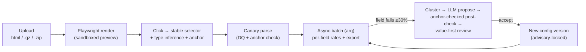

# Scrapesmith

**A self-healing HTML parser. A non-technical operator clicks the data they want in a rendered page; when the site's markup drifts and extraction breaks, an LLM rebuilds the broken selectors — and _proves_ the rebuild extracts the right value, not just a valid-looking one.**

---

## Why

Every HTML scraper rots. A site ships a redesign, renames a class, wraps a price in one more `<div>`, and your selectors silently start returning empty strings — or worse, the *wrong* number. Fixing it means pulling an engineer to re-inspect the DOM and patch selectors, for every site, every drift. Non-technical operators — the people who actually own the data — can't touch it.

Two things make that painful, and Scrapesmith targets both:

1. **Picking is brittle.** Selectors chosen against a "cleaned" or statically-parsed DOM don't always resolve against the real browser DOM. What you click isn't always what you extract.
2. **Healing is dangerous.** An LLM that "fixes" a selector can happily return a value that passes validation but is *wrong* — it grabs the MRP instead of the sale price, and every downstream number is quietly corrupted.

Scrapesmith's bet: **the browser is the single source of truth**, and **healing is only trustworthy if it's checked against the value the operator originally confirmed** (the field's *anchor*). A heal that diverges from the anchor is flagged as suspect and never auto-applied.

## What

A tool where an operator, with no code:

- **Uploads** raw HTML — a single file, a `.gz`, or a `.zip` batch (with zip-bomb / size caps).
- **Clicks** the fields they want in a Playwright-rendered preview. Each click generates a *stable, provably-resolving* selector (id → `data-*` → `itemprop`/`role` → semantic class → structural fallback), auto-detects the field type (price, rating, discount %, …), and snapshots the confirmed value as the field's **anchor**.
- **Tests** the config on one file (canary) — see every field's value, its data-quality status, and whether it matches the anchor.
- **Runs** the config across the whole batch as an async job with live progress, per-field failure rates, and **CSV / nested-JSON export**.
- **Heals** when a batch drifts: failing files are clustered by DOM skeleton, an LLM proposes new selectors per cluster, and every proposal is run through a code post-check (resolves → passes DQ → not too positional → **matches the anchor** → holds on 2 more files in the cluster). The operator reviews *values, not selectors*, accepts the good ones, and a new config version is written.
- **Versions** every config with a diff view and the ability to pin a batch to a specific version — concurrent heals serialize under a Postgres advisory lock instead of colliding.

Local Ollama is the default heal model; a cloud model (e.g. Claude) is opt-in and configurable. The ✨ "Ask AI" field classifier is always opt-in — interactive clicking never blocks on a model.

## How

**The browser is the DOM source of truth.** The same headless Chromium context that renders the read-only preview also runs the extraction `locator()` calls, so there's no parity gap between "what you picked" and "what gets scraped". Untrusted HTML renders in isolated, egress-blocked contexts; the snapshot streamed to the operator is script-stripped, CSP-locked, and shown in a sandboxed iframe (§14).



**Selectors are generated from a descriptor, validated server-side.** Because the preview is a sandboxed iframe, clicks post an element *descriptor* (attributes are script-independent) to the app, which regenerates candidate selectors and confirms each resolves uniquely against the raw render — the §8.1 round-trip that closes the parity gap.

**Healing is guarded, not trusted.** The trigger is per-field (heal as soon as *any* field fails on ≥30% of items), failing files are clustered by a normalized `dom_skeleton_hash`, and the model's proposal only counts if the code post-check passes — including the **anchor check** that catches "passes DQ but wrong value". Suspect proposals are surfaced with the divergence called out; they're never silently applied.

### Stack

| Layer | Tech |
|-------|------|
| Backend | Python 3.9, FastAPI (async), SQLAlchemy 2 (async) + asyncpg, Alembic |
| Data / jobs | Postgres 16, Redis 7 + arq (async batch + heal jobs, SSE progress) |
| Rendering / extraction | Playwright (headless Chromium) — renders the preview **and** runs extraction |
| Frontend | Next.js 15 (App Router, React + TypeScript) |
| Heal LLM | Pluggable provider — Ollama (default) / cloud Claude (opt-in), anchor-checked in code |

### Quickstart

```bash
# 1. Infra (either Docker or local services)
docker compose up -d                 # postgres:16 + redis:7
#   or: brew install postgresql@16 redis && brew services start postgresql@16 redis

# 2. Backend
cd backend
python3.9 -m venv .venv && .venv/bin/pip install -e '.[dev]'
.venv/bin/playwright install chromium
.venv/bin/alembic upgrade head        # create the 6 tables
.venv/bin/uvicorn app.main:app --reload            # API at :8000
.venv/bin/arq app.worker.WorkerSettings            # background worker (separate shell)

# 3. Frontend
cd frontend && npm install && npm run dev           # UI at :3000
```

Config via `SCRAPESMITH_DATABASE_URL`, `SCRAPESMITH_REDIS_URL`; opt-in heal model via `ANTHROPIC_API_KEY` / `SCRAPESMITH_CLOUD_MODEL` or `OLLAMA_HOST`.

### Tests

```bash
cd backend && .venv/bin/pytest        # 143 tests; DB/Redis/Playwright tests self-skip if unavailable
.venv/bin/ruff check .
cd frontend && npm run typecheck && npm run build
```

Integration tests gate on service reachability, so the suite stays green on a bare machine; CI runs them against Postgres/Redis service containers.

## Project layout

```
backend/
  app/        FastAPI service — routes/, render, parser, dq, inference,
              selector ladder, heal, batch jobs, export, versioning
  spike/      Phase 0 de-risk rig (heal providers + bench) — frozen
  alembic/    migrations
frontend/     Next.js app — upload, click-to-select picker, canary,
              batch results, heal review, versions, advanced mode
docs/         diagrams / wireframes
.claude/      plans, task tracking, lessons
```

## Docs

- **Design** — the full system spec (data model, DQ engine, heal contract, security): [`.claude/plans/self-healing-parser.md`](.claude/plans/self-healing-parser.md)
- **Phase plans** — de-risk spike through advanced mode: [`.claude/plans/`](.claude/plans/)
- **Status** — implemented in phases 0.5 → 8 (skeleton, upload/render, click-select, inference, parse/DQ/anchors, async batch/export, heal, versioning, advanced mode). The live heal/model **GATE** (real drift pairs + a running model) is the one deferred step — all model-independent code is done, and heal degrades honestly to `model: "unavailable"` when no provider is configured.

## Status

Active development on `dev`. Backend: 143 tests passing, lint clean. Frontend: type-checked and building.
