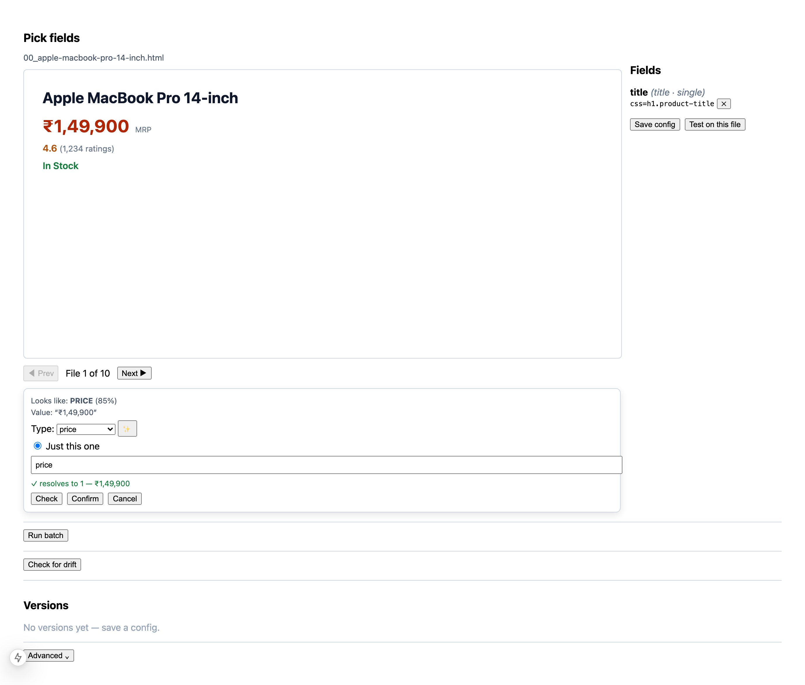
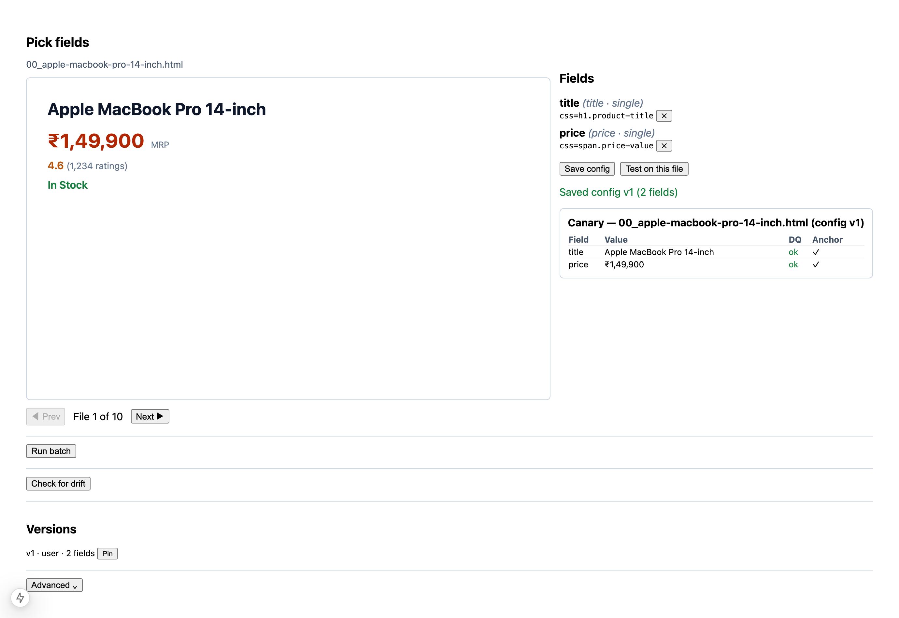
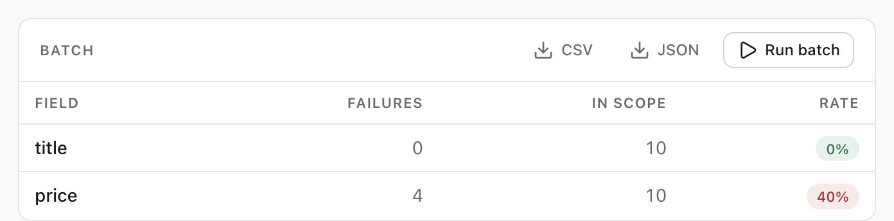
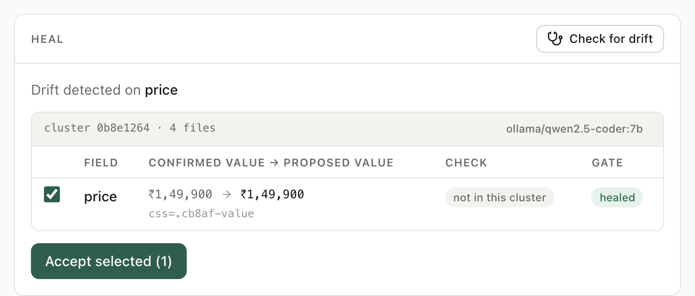
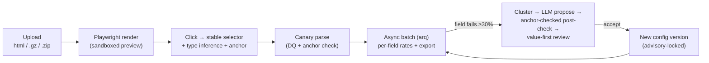

# Scrapesmith

**A self-healing HTML parser.** A non-technical operator clicks the data they want in a rendered page; when the site's markup drifts and extraction breaks, an LLM rebuilds the broken selectors — and _proves_ the rebuild extracts the right value, not just a valid-looking one.

Every HTML scraper rots: a redesign renames a class or wraps a price in one more `<div>`, and your selectors silently return empty strings — or worse, the *wrong* number. Fixing it normally means an engineer re-inspecting the DOM for every site, every drift. Scrapesmith lets the data owner do it with clicks, and heals itself when markup changes — safely, because a heal only counts if it reproduces the value the operator originally confirmed (the field's **anchor**), not merely a value of the right type.

## Features

- **Click-to-pick, no code** — click a field in a live preview; get a stable selector that *provably resolves* (id → `data-*` → `itemprop`/`role` → semantic class → structural fallback), an auto-detected type (price, rating, discount %, …), and a captured anchor value.
- **Browser is the source of truth** — the same headless Chromium that renders the preview runs the extraction, so what you pick is what you scrape. No cleaned-DOM parity gap.
- **List detection** — click one item, capture all N similar ones.
- **Data-quality engine** — per field: `ok / empty / regex_fail / type_fail / range_fail / out_of_scope`, with a canary "test on one file" before the batch.
- **Async batch + export** — run across a whole upload as a background job with live progress and per-field failure rates; export CSV (one row per list item) or nested JSON.
- **Self-healing on drift** — failing files cluster by DOM skeleton, an LLM proposes new selectors per cluster, and every proposal is code-checked (resolves → passes DQ → not too positional → **matches the anchor** → holds on more files). You review *values, not selectors*; suspect proposals are flagged and never auto-applied.
- **Versioned configs** — every change is a new version with a diff view and per-batch pinning; concurrent heals serialize under a Postgres advisory lock.
- **Pluggable LLM** — local Ollama by default, cloud Claude opt-in. The ✨ field classifier is always opt-in — interactive clicking never blocks on a model.

## See it work

| Click a value to pick it | Canary-test before the batch |
|---|---|
|  |  |
| Inference guesses the type (PRICE, 85%); the selector is confirmed to resolve to exactly 1 element before you can confirm. | Both fields `ok`, both matching their captured anchor, on one file — before spending a batch run. |

| Batch + per-field failure rates | Drift → cluster → heal, proved against the anchor |
|---|---|
|  |  |
| Crawl 1 catches a redesign mid-rollout: 4 of 10 files post-redesign, both fields at exactly 40%. | Crawl 2, rollout complete — 100% failure. A local 7B model rewrites both selectors, and each is accepted only because it reproduces the value the operator confirmed (`✓ ₹1,49,900`). |

## Quickstart

```bash
# 1. Infra (Docker, or local services)
docker compose up -d                 # postgres:16 + redis:7
#   or: brew install postgresql@16 redis && brew services start postgresql@16 redis

# 2. Backend
cd backend
python3.12 -m venv .venv && .venv/bin/pip install -e '.[dev]'
.venv/bin/playwright install chromium
.venv/bin/alembic upgrade head                     # create the schema
.venv/bin/uvicorn app.main:app --reload            # API at :8000
.venv/bin/arq app.worker.WorkerSettings            # background worker (separate shell)

# 3. Frontend
cd frontend && npm install && npm run dev           # UI at :3000
```

**Config** via env: `SCRAPESMITH_DATABASE_URL`, `SCRAPESMITH_REDIS_URL`; opt-in heal model via `ANTHROPIC_API_KEY` / `SCRAPESMITH_CLOUD_MODEL`, or `OLLAMA_HOST`.

## How it works

The whole product hinges on two ideas.

**1. The browser is the single source of truth.** The same isolated Chromium context that renders the read-only preview also runs the extraction `locator()` calls — so a selector picked in the preview resolves identically at extract time. Untrusted HTML renders in egress-blocked contexts; the snapshot streamed to the operator is script-stripped, CSP-locked, and shown in a sandboxed iframe (§14). Because that iframe can't share a DOM with the app, a click posts an element *descriptor* (attributes are script-independent) to the backend, which regenerates candidate selectors and confirms each resolves uniquely against the raw render — the round-trip that closes the parity gap (§8.1).

**2. Healing is guarded, not trusted.** An LLM that "fixes" a selector can return a value that passes validation but is wrong (the MRP instead of the sale price). So the trigger is per-field (heal when *any* field fails on ≥30% of items), failing files cluster by a normalized `dom_skeleton_hash`, and the model's proposal only counts if a code post-check passes — including the **anchor check** that catches "passes DQ but wrong value" (§10). Suspect proposals surface the divergence; they're never silently applied.



## Stack

| Layer | Tech |
|-------|------|
| Backend | Python 3.12, FastAPI (async), SQLAlchemy 2 (async) + asyncpg, Alembic |
| Data / jobs | Postgres 16, Redis 7 + arq (async batch + heal jobs, SSE progress) |
| Rendering / extraction | Playwright (headless Chromium) — renders the preview **and** runs extraction |
| Frontend | Next.js 15 (App Router, React + TypeScript) |
| Heal LLM | Pluggable provider — Ollama (default) / cloud Claude (opt-in), anchor-checked in code |

## Tests

```bash
backend/.venv/bin/pytest              # 173 passed with Postgres up; 158 passed / 15 skipped without
cd backend && .venv/bin/ruff check .
cd frontend && npm run typecheck && npm run build
```

Integration tests gate on service reachability, so the suite stays green on a bare machine; CI runs them against Postgres/Redis service containers.

**Heal benchmark** — measures selector repair over a corpus of deliberately broken pages:

```bash
cd backend && python -m spike --fixtures fixtures/drift --provider ollama --out artifacts
```

`fixtures/generate.py` mutates four hand-written base pages with five labelled drift transforms
(`class_rename`, `tag_swap`, `wrapper_insert`, `attr_strip`, `combo`) into 20 before/after cases,
verifying per field that the old selector really did break and the value really did survive. Each
proposal is scored through the product's own `post_check` gate, so the headline `healed_rate` counts
only repairs that would actually ship.

| metric | value | |
|---|---|---|
| `healed_rate` | **94.8%** (91.7–97.9 over 4 runs) | correct **and** accepted by the gate — the headline |
| `anchor_correct_rate` | tracks `healed_rate` | the model produced the right value |
| `resolve_but_wrong_rate` | 0–2.1% | guard: resolved a plausible *wrong* value; a rise here is a regression |
| `no_proposal_rate` | 0.00% | |

Read the range, not the point: the provider samples at the model's default temperature, so
repeat runs of the same config differ by up to 6.3pp.

## Project layout

```
backend/
  app/        FastAPI service — routes/, render, parser, dq, inference,
              selector ladder, heal, batch jobs, export, versioning
  spike/      heal providers, prompt, drift mutator, and the eval bench (`python -m spike`)
  fixtures/   base pages + the generated drift corpus the bench measures against
  alembic/    migrations
frontend/     Next.js app — upload, click-to-select picker, canary,
              batch results, heal review, versions, advanced mode
.claude/      design plan, phase plans, task tracking, lessons
```

## Docs & status

- **[Architecture](docs/architecture.md)** — how it's built and why: the two core ideas, components, request flow, data model, key mechanisms.
- **[API reference](docs/api.md)** — every endpoint with request/response shapes (interactive at `/docs`).
- **[Deployment & operations](docs/deployment.md)** — run locally, configure, migrate, test, and what to harden for production.
- **Full design spec** (every decision, wireframes, security model): [`.claude/plans/self-healing-parser.md`](.claude/plans/self-healing-parser.md)
- **Phase plans** (de-risk spike → advanced mode): [`.claude/plans/`](.claude/plans/)

## Status & limitations

Active development on `dev`. Phases 0.5 → 8 are implemented (skeleton, upload/render, click-select, inference, parse/DQ/anchors, async batch/export, heal, versioning, advanced mode). Nothing is stubbed — there are no `TODO`/`NotImplementedError` placeholders in `app/` or the frontend. Backend is lint-clean; the frontend type-checks and builds.

What that does **not** mean:

- **The heal rate is 94.8% ± 3 on synthetic drift, and the ± is the important part.** Four runs of the *identical* config scored 91.7 / 91.7 / 97.9 / 97.9 (mean 94.8%, spread 6.3pp) across 48 fields, local `qwen2.5-coder:7b` ([latest report](backend/artifacts/phase0_report.md)). The provider samples at the model's default temperature, so proposals vary run to run: between two runs only 14 of 48 selectors were identical and 6 fields flipped correctness. Any single number here — including one quoted from one run — is worth about ±3pp. Pinning `temperature=0` is the next piece of work, and is a prerequisite for measuring anything against this baseline.
- **`resolve_but_wrong_rate` sits at 0–2.1%, and that metric is the point of the anchor check.** In one run the model proposed `div.c0929-price` for the product price, resolving to `₹2,999` — the header promo strip. It passes the price regex, so DQ returned `ok`. The anchor check caught it and gated the proposal to `suspect`, never auto-applied; without that check a wrong price ships silently. What is structural rather than luck is that such a value *exists to be picked at all*: the fixture pages carry decoys (a struck-through MRP, a promo strip, an "also viewed" rail) by construction. An earlier decoy-free corpus could not register this failure mode at all.
- **The anchor check is only evaluated on the page its value came from.** An anchor asserts "on this page, this field reads ₹1,49,900", so it means nothing on a different product's page. When the anchor's page isn't in the failing cluster the review shows `not in this cluster` and the proposal rests on DQ plus cross-file validation alone — weaker evidence, and the UI says so rather than implying the anchor passed.
- **15 of the 152 tests need Postgres** — batch jobs, canary, config routes, versioning persistence, migrations, the heal route. They run in CI against service containers and skip locally so the suite stays green on a bare machine, which means a bare `pytest` reports 137 rather than 152.
- **Single-tenant, no auth.** There is no user model, no authorization on any route, and no rate limiting. It is a local tool, not a deployed service.
- **Untrusted HTML is rendered in egress-blocked, script-stripped, CSP-locked contexts**, which is a real mitigation but not a substitute for a sandbox at the OS level. Prompt-injection hardening of the heal prompt is not implemented.
