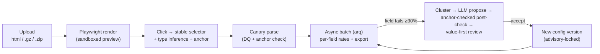

# Scrapesmith

**A self-healing HTML parser.** A non-technical operator clicks the data they want in a rendered page; when the site's markup drifts and extraction breaks, an LLM rebuilds the broken selectors — and _proves_ the rebuild extracts the right value, not just a valid-looking one.

Every HTML scraper rots: a redesign renames a class or wraps a price in one more `<div>`, and your selectors silently return empty strings — or worse, the *wrong* number. Fixing it normally means an engineer re-inspecting the DOM for every site, every drift. Scrapesmith lets the data owner do it with clicks, and heals itself when markup changes — safely, because a heal only counts if it reproduces the value the operator originally confirmed (the field's **anchor**), not merely a value of the right type.

## Features

- **Click-to-pick, no code** — click a field in a live preview; get a stable selector that *provably resolves* (id → `data-*` → `itemprop`/`role` → semantic class → structural fallback), an auto-detected type (price, rating, discount %, …), and a captured anchor value.
- **Browser is the source of truth** — the same headless Chromium that renders the preview runs the extraction, so what you pick is what you scrape. No cleaned-DOM parity gap.
- **List detection** — click one item, capture all N similar ones.
- **Data-quality engine** — per field: `ok / empty / regex_fail / type_fail / range_fail / out_of_scope`, with a canary "test on one file" before the batch.
- **Async batch + export** — run across a whole upload as a background job with live progress and per-field failure rates; export CSV (one row per list item) or nested JSON.
- **Self-healing on drift** — failing files cluster by DOM skeleton, an LLM proposes new selectors per cluster, and every proposal is code-checked (resolves → passes DQ → not too positional → **matches the anchor** → holds on more files). You review *values, not selectors*; suspect proposals are flagged and never auto-applied.
- **Versioned configs** — every change is a new version with a diff view and per-batch pinning; concurrent heals serialize under a Postgres advisory lock.
- **Pluggable LLM** — local Ollama by default, cloud Claude opt-in. The ✨ field classifier is always opt-in — interactive clicking never blocks on a model.

## Quickstart

```bash
# 1. Infra (Docker, or local services)
docker compose up -d                 # postgres:16 + redis:7
#   or: brew install postgresql@16 redis && brew services start postgresql@16 redis

# 2. Backend
cd backend
python3.9 -m venv .venv && .venv/bin/pip install -e '.[dev]'
.venv/bin/playwright install chromium
.venv/bin/alembic upgrade head                     # create the schema
.venv/bin/uvicorn app.main:app --reload            # API at :8000
.venv/bin/arq app.worker.WorkerSettings            # background worker (separate shell)

# 3. Frontend
cd frontend && npm install && npm run dev           # UI at :3000
```

**Config** via env: `SCRAPESMITH_DATABASE_URL`, `SCRAPESMITH_REDIS_URL`; opt-in heal model via `ANTHROPIC_API_KEY` / `SCRAPESMITH_CLOUD_MODEL`, or `OLLAMA_HOST`.

## How it works

The whole product hinges on two ideas.

**1. The browser is the single source of truth.** The same isolated Chromium context that renders the read-only preview also runs the extraction `locator()` calls — so a selector picked in the preview resolves identically at extract time. Untrusted HTML renders in egress-blocked contexts; the snapshot streamed to the operator is script-stripped, CSP-locked, and shown in a sandboxed iframe (§14). Because that iframe can't share a DOM with the app, a click posts an element *descriptor* (attributes are script-independent) to the backend, which regenerates candidate selectors and confirms each resolves uniquely against the raw render — the round-trip that closes the parity gap (§8.1).

**2. Healing is guarded, not trusted.** An LLM that "fixes" a selector can return a value that passes validation but is wrong (the MRP instead of the sale price). So the trigger is per-field (heal when *any* field fails on ≥30% of items), failing files cluster by a normalized `dom_skeleton_hash`, and the model's proposal only counts if a code post-check passes — including the **anchor check** that catches "passes DQ but wrong value" (§10). Suspect proposals surface the divergence; they're never silently applied.



## Stack

| Layer | Tech |
|-------|------|
| Backend | Python 3.9, FastAPI (async), SQLAlchemy 2 (async) + asyncpg, Alembic |
| Data / jobs | Postgres 16, Redis 7 + arq (async batch + heal jobs, SSE progress) |
| Rendering / extraction | Playwright (headless Chromium) — renders the preview **and** runs extraction |
| Frontend | Next.js 15 (App Router, React + TypeScript) |
| Heal LLM | Pluggable provider — Ollama (default) / cloud Claude (opt-in), anchor-checked in code |

## Tests

```bash
cd backend && .venv/bin/pytest        # 143 tests; DB/Redis/Playwright tests self-skip if unavailable
.venv/bin/ruff check .
cd frontend && npm run typecheck && npm run build
```

Integration tests gate on service reachability, so the suite stays green on a bare machine; CI runs them against Postgres/Redis service containers.

## Project layout

```
backend/
  app/        FastAPI service — routes/, render, parser, dq, inference,
              selector ladder, heal, batch jobs, export, versioning
  spike/      Phase 0 de-risk rig (heal providers + bench) — frozen
  alembic/    migrations
frontend/     Next.js app — upload, click-to-select picker, canary,
              batch results, heal review, versions, advanced mode
.claude/      design plan, phase plans, task tracking, lessons
```

## Docs & status

- **Design spec** (data model, DQ engine, heal contract, security, wireframes): [`.claude/plans/self-healing-parser.md`](.claude/plans/self-healing-parser.md)
- **Phase plans** (de-risk spike → advanced mode): [`.claude/plans/`](.claude/plans/)

Active development on `dev`. Implemented in phases 0.5 → 8 (skeleton, upload/render, click-select, inference, parse/DQ/anchors, async batch/export, heal, versioning, advanced mode); backend 143 tests passing and lint clean, frontend type-checked and building. The one deferred step is the live heal **GATE** (real drift pairs + a running model) — all model-independent code is done, and heal degrades honestly to `model: "unavailable"` when no provider is configured.
