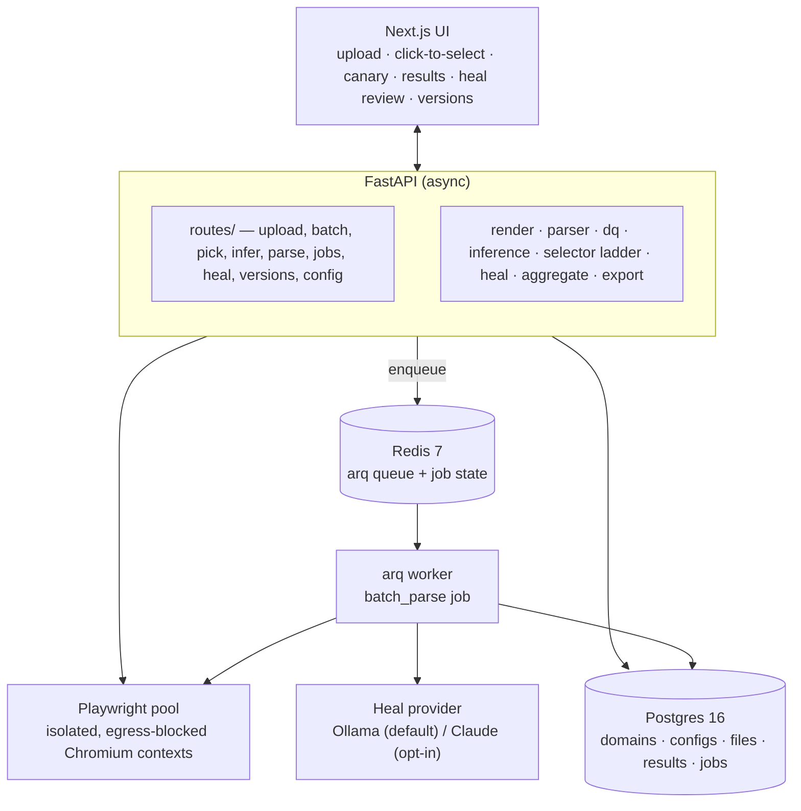
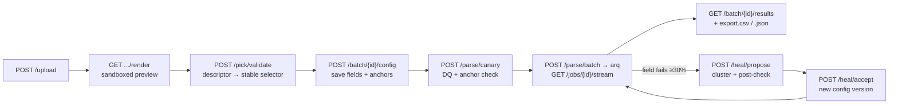

# Architecture

How Scrapesmith is put together and why. For the exhaustive design spec (every decision, wireframes, security model), see [`.claude/plans/self-healing-parser.md`](../.claude/plans/self-healing-parser.md).

## The two ideas everything rests on

1. **The browser is the single source of truth.** The same isolated headless Chromium context that renders the read-only preview also runs the extraction `locator()` calls. A selector picked in the preview therefore resolves *identically* at extract time — there is no "cleaned DOM vs real DOM" parity gap that plagues static-parser scrapers.
2. **Healing is verified, not trusted.** When an LLM rebuilds a broken selector, the proposal is only accepted if a code post-check proves it reproduces the value the operator originally confirmed (the field **anchor**) — not merely *a* value of the right type. This is what stops "passes validation but wrong" corruption.

## Components

- **FastAPI (async)** — all synchronous request/response endpoints: upload, config CRUD, pick validation, inference, canary parse, heal propose/accept, versions, export.
- **arq worker** — a separate process (`arq app.worker.WorkerSettings`) that runs the batch-parse job so 500-file batches don't time out an HTTP request. Progress is written to the `job` row and streamed to the UI over SSE.
- **Playwright pool** — headless Chromium. Each file renders in its own ephemeral, network-blocked context; the same context is used for rendering the preview and for extraction.
- **Postgres** — configs, results, jobs (see data model). **Redis** — arq queue + job state.
- **Heal provider** — a pluggable interface (`spike.heal.provider.HealProvider`); Ollama by default, cloud Claude opt-in, selected by environment.

## Request → extract → heal flow

## Key mechanisms

**Descriptor-based picking.** The preview is a `sandbox="allow-scripts"` iframe with no same-origin access, so the parent app can't read its DOM. On click, an injected overlay computes an element *descriptor* — `{tag, id, classes, data-*, itemprop, role, landmark, nth_of_type}` (all script-independent attributes) — and `postMessage`s it to the app. The backend regenerates candidate selectors from the descriptor and confirms each resolves uniquely against the **raw** render via `locator().count()`. Attributes transfer cleanly between the sanitized snapshot and the raw page; the structural fallback uses `:nth-of-type` (counts same-tag siblings), which is unaffected by script-node removal.

**Selector stability ladder** (`app/selector.py`, §8.1). Candidates are generated most-→least robust and the first that *uniquely resolves* wins: `#id` (non-generated) → `[data-*]` → `[itemprop]`/`[role]` → `landmark .stable-class` → `landmark tag:nth-of-type(n)`.

**Data quality** (`app/dq.py`, §9). Per field: `ok | empty | regex_fail | type_fail | range_fail | out_of_scope`, driven by a `dq` spec (`required`, `regex`, `parses_as`, `min_len`/`max_len`, `range`). Field-type presets (`app/presets.py`) supply default DQ + regex + synonyms per type.

**Healing** (`app/heal.py`, §10). Trigger is per-field: heal as soon as any field fails on ≥30% of items. Failing files cluster by a normalized `dom_skeleton_hash` (tag tree with dynamic attributes stripped, so structurally-identical pages collide). The LLM proposes selectors per cluster; each proposal passes a 6-step post-check — valid prefix → resolves → passes DQ → not too positional → **matches the anchor (normalized)** → holds on 2 more cluster files. Result per field: `healed | suspect | still_broken`. Suspect (diverges from anchor) is surfaced, never auto-applied. Anchor-correctness is enforced here in code, independent of the model prompt.

**Versioning** (`app/storage.py`, §11). Each accepted config is a new `config_version`; the version number is computed under `pg_advisory_xact_lock(hashtext(domain_id))`, so concurrent saves/heals serialize instead of colliding on `unique(domain_id, version)`. A batch runs against its pinned version if set, else the domain's latest (`effective_config_version`).

**Security** (§14). Untrusted HTML renders in isolated contexts that abort all non-`file://` requests (no SSRF/egress). The snapshot streamed to the browser has `<script>`s stripped, a strict CSP, and renders in a sandboxed iframe. Upload caps (size / count / uncompressed total) are enforced *before* extraction (zip-bomb guard); archive filenames are sanitized to a basename (no path traversal).

## Data model

Six tables (full DDL + ER diagram in the design spec §6):

| Table | Holds |
|-------|-------|
| `domain` | a host + page-type combo; `render_js` toggle |
| `config_version` | one row per saved config version; `fields` jsonb; `created_by` = user / llm-heal / llm-bootstrap |
| `upload_batch` | an upload (single file or archive); status; pinned `config_version_id` |
| `upload_file` | one row per file; `sha256`, `dom_skeleton_hash`, on-disk `raw_html_path` |
| `parse_result` | extraction output per file: `data`, `flags`, `field_status` (jsonb) |
| `job` | async work tracking; `state`, `progress` jsonb — drives the SSE progress stream |

`config_version ↔ upload_batch ↔ upload_file` form a circular FK; the two nullable back-references use `use_alter` so the initial migration can create the tables in any order.

## Tech choices

See [`deployment.md`](deployment.md) for the stack table and run instructions, and the [phase plans](../.claude/plans/) for the incremental build (de-risk spike → skeleton → … → advanced mode).
